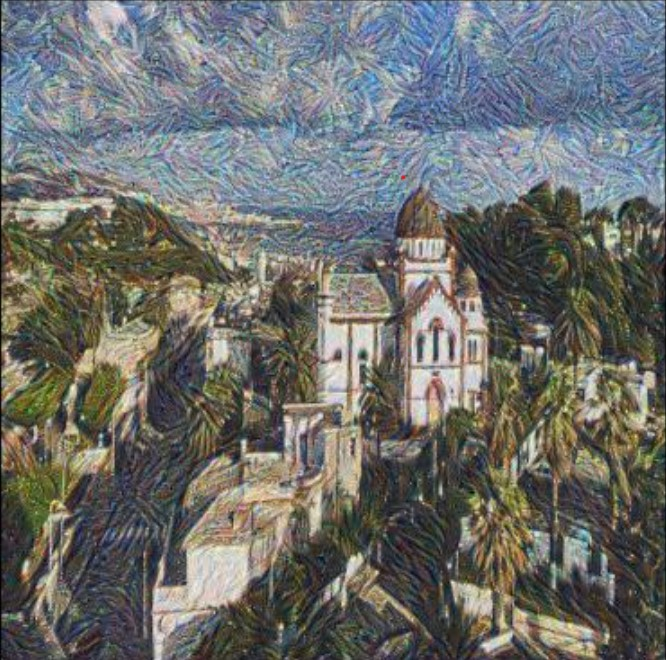

# Neural Style Transfer (NST)

## Overview

Neural Style Transfer (NST) is a technique in deep learning that allows for the transfer of artistic styles from one image to another. It utilizes convolutional neural networks (CNNs) to extract style and content features from two input images: a content image and a style reference image. By minimizing a certain loss function, NST generates a new image that combines the content of the content image with the artistic style of the style reference image.

This notebook demonstrates the implementation of Neural Style Transfer using TensorFlow . It walks through the process of loading images, extracting features, defining the loss functions, and optimizing the generated image to minimize the total loss.

## Example

### Content Image

### Style Image

### Generated Image
